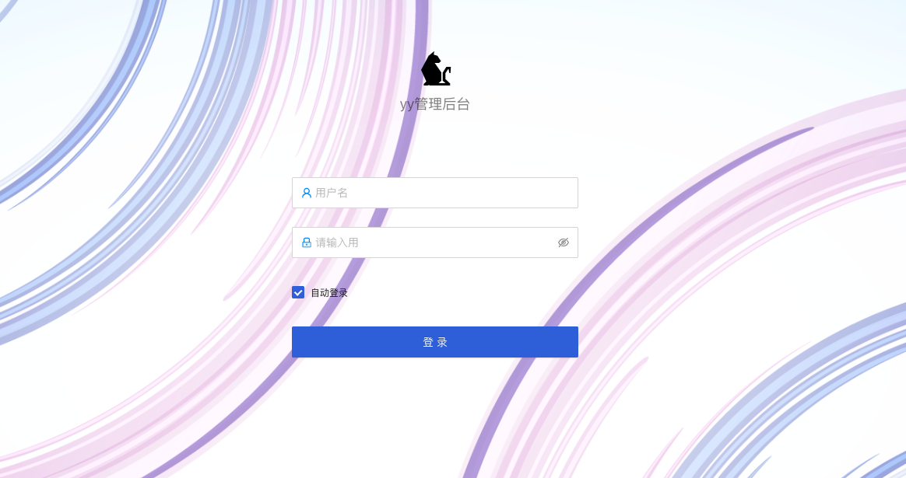
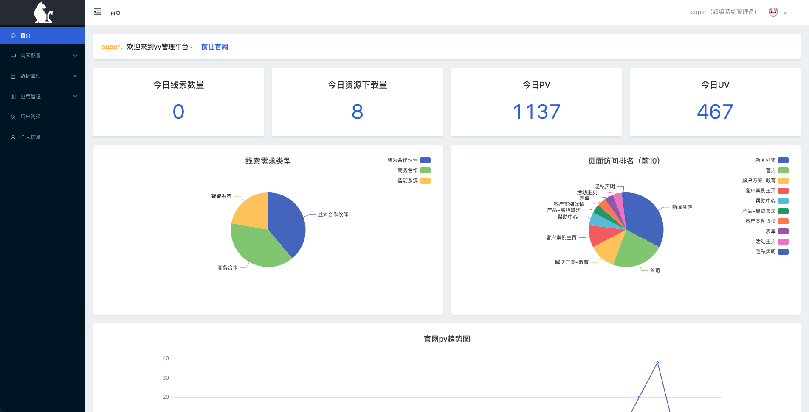
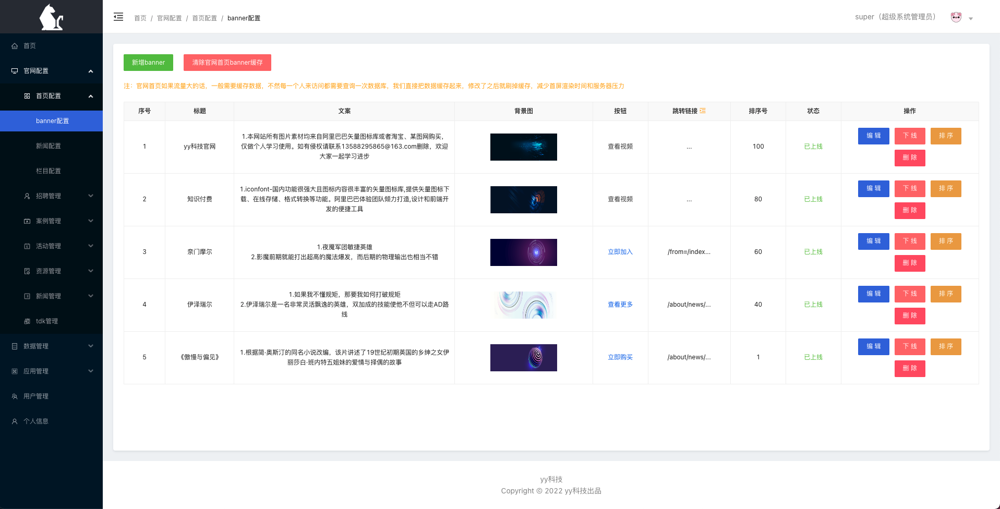
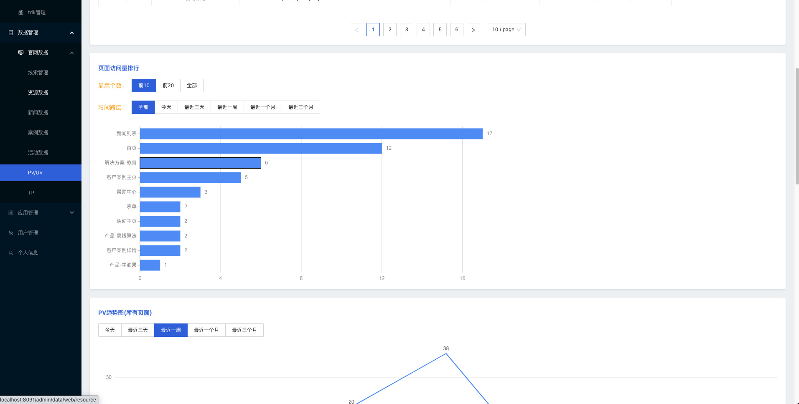
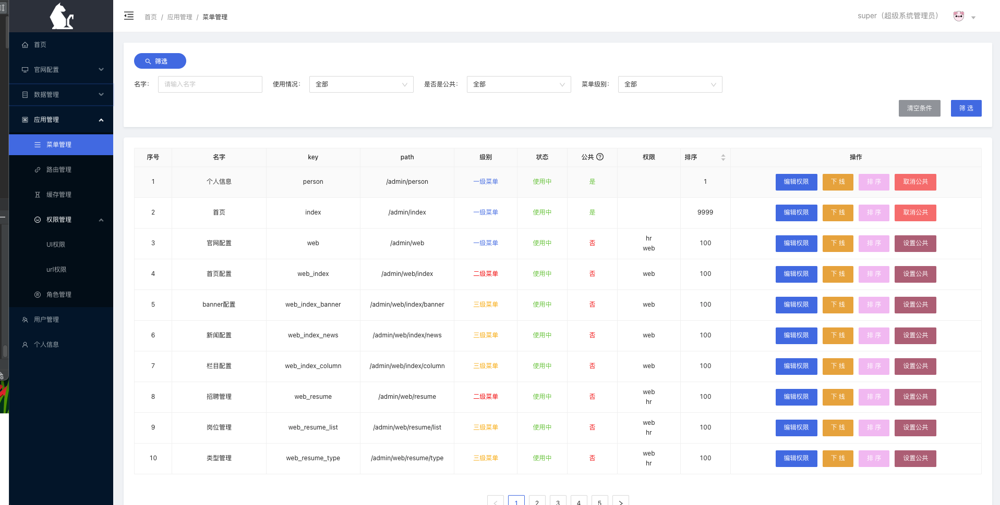
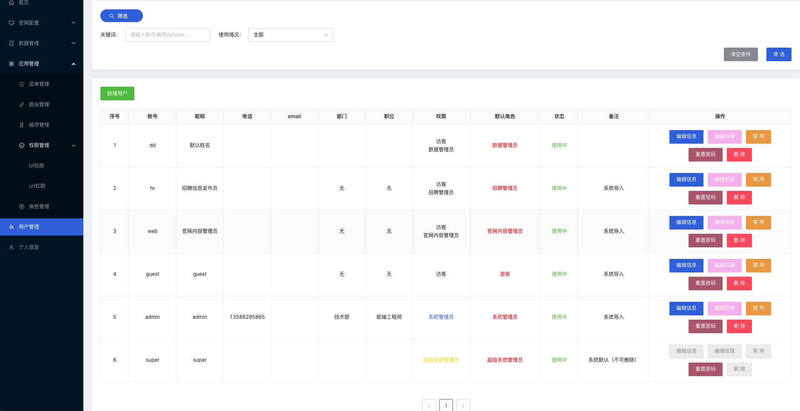

### 项目简介
本项目为常见crm管理后台,cra架构——react + mobx + stylus + axios，项目非demo，包含了完整了后端接口、单点登录、权限管理、
路由菜单管理、角色管理认证，403/404跳转。现主要功能为官网管理后台（管理官网内容和提供部分统计数据支持），
### 项目地址
https://github.com/guyang66/gy-nodejs-rcoco
登录页面：

首页：

官网banner管理：

pv/uv数据管理：

应用菜单管理：

系统用户管理：


### 目录结构
```
├─ build                          生成环境打包后的资源目录
├─ config                         应用配置文件
├─ mock                           mock目录
    ├─ api                        mock json 文件
    ├─ index.js                   mock 入口文件（启动文件）
    ├─ json-server.json           (mock)json-server 配置文件
    ├─ middlewares.js             json-server中间件（主要用于将post请求转化为get请求）
    ├─ README.md
    ├─ routes.json                mock路由映射规则
├─ public                         静态资源目录
    ├─ fakeCdn                    下载存放的外部资源/第三方资源（如reactjs、antdjs、lodashjs等...）
    ├─ favicon.svg
    ├─ index.html                 单页面应用html文件
├─ resource
    ├─ fakeCdn                    拷贝的外部资源包（避免下载失败和mock模式下能正常启动应用）
    ├─ preview                    应用页面预览图片
├─ scripts                        脚本
    ├─ down                       下载外部资源脚本
    ├─ deploy                     打包发布脚本
    ├─ tar                        压缩打包build后的资源
├─ src
    ├─ api                        api接口实现类
        ├─ activity.js
        ├─ ...
    ├─ assets                     应用使用资源，如图片等.
    ├─ common  
        ├─ common.styl            公共css
        ├─ fetch.js               axios封装
        ├─ flexbox.styl           盒模型布局css简写  
        ├─ utils.js               utils工具方法
        ├─ variables.styl         stylus变量  
    ├─ components                 react封装组件
    ├─ config                     前端页面菜单配置文件
    ├─ helper                     权限、路由菜单校验辅助方法
    ├─ pages
        ├─ 403                    403页面  
        ├─ 404                    404页面 
        ├─ layout                 layout布局
        ├─ login                  登录页面
        ├─ views
            ├─ app                应用管理
            ├─ data               数据管理  
            ├─ person             个人信息  
            ├─ userManage         用户管理  
            ├─ web                官网内容管理  
            ├─ welcome            首页/欢迎页
    ├─ router
        ├─ common-routes.js       公共（无权限）路由
        ├─ index.js               路由组件
        ├─ page-routes.js         页面级别路由（如404、403、login校验）  
        ├─ private-routes.js      私有路由（需要和服务端下发的路由列表匹对）
    ├─ store                      数据store仓库
    ├─ index.js                   应用主入口js
    ├─ index.style                index公共css
├─ .env.development               开发环境配置文件  
├─ .env.production                生产环境配置文件  
├─ .eslintigonre                  eslint忽略
├─ .eslintrc.js                   eslint配置文件
├─ .gitignore                     git忽略
├─ config-overrides.js            customize-cra配置文件（重写webpack配置）
├─ package.json
...    
``` 

### mock模式
因为服务端需要链接数据库（当然服务端也有mock模式，但是服务端在mock模式下和本项目即无法api互通）才能正常启动，才能使用rcoco完整功能，为了方便不需要启动服务端即可
访问预览本项目页面的同学，提供了mock模式，安装依赖（npm install）之后，使用npm run local命令即可。注意在mock模式下，随意账号密码都可以登录该系统（失去了服务端鉴权逻辑），
部分功能将（如增删查改）受限。如要体验完整的功能请下载对应的服务端（服务端会提供完整的sql，帮助你正常启动和体验完整功能）

### 服务端项目
#### 项目地址
https://github.com/guyang66/gy-koa-kcoco
#### 服务端介绍
服务端项目（后面以kcoco代替）是本项目（后面以rcoco代替）的的双子项目，kcoco为nodejs后端应用，提供一套官网的ssr前端页面，并为rcoco提供api接口和常规的后台服务。rcoco则是官网的后台管理系统，可以实时修改官网
内容，无需重新发布。
### 项目启动
#### 安装依赖
```
npm i
```
#### （从cdn）下载外部资源
因为我没有自己的cdn，所有用服务端（kcoco）静态资源来模拟cdn，需要开启服务端（kcoco），才能下载成功。
注：mock模式下不会去服务端下载外部资源，只会把/resource/fakeCdn 复制到/public/fakeCdn下。
```
npm run down
```
#### 本地开发
本地开发需要开启服务端（kcoco），因为有下载外部资源的操作，也可直接把/resource/fakeCdn文件夹复制到/public下
如果没有配置服务端（kcoco）
```
npm run start
```
#### 启动mock服务
mock服务详细说明请查看./mock/README.md文档
```
npm run mock
```
#### mock模式：同时启动mock服务和客户端
该模式下，可完全脱离服务端运行(避免没有启动服务端的同学，因为接口报错而无法预览)，不需要服务端支持，但是部分功能受限
```
npm run local
```
#### 生产环境打包
```
npm run build
```
#### 代码美化
```
npm run eslint
npm run eslint-fix
```
#### 部署脚本
请设置好/scripts/deploy/config.js中对应服务器参数
```
npm run deploy
```

*** 
### 生产环境部署
1、安装nginx
2、部署
```
server {
  listen       8091;
  server_name  rcoco;
  charset utf-8;
  root /opt/workspace/rcoco/;
  location /{
        index  index.html index.htm;
        try_files $uri /index.html;
  }
}
```
3、设置nginx代理，保证api能正常调用(需要服务端启动)，完整版如下：
```
http {
    ...
    server {
            listen       80;
            server_name  localhost;
    
            location / {
                # kcoco代理
                proxy_set_header Host $host;
                proxy_set_header X-Real-IP $remote_addr;
                proxy_set_header REMOTE_HOST $remote_addr;
                proxy_set_header X-Forwarded-For $proxy_add_x_forwarded_for;
                root   html;
                index  index.html index.htm;
                proxy_pass http://localhost:8090/;
            }
    
            location /admin/ {
                root   html;
                index  index.html index.htm;
                proxy_pass http://localhost:8091/;
            }
    
            location /admin/api/ {
                # 设置proxy，把host带过去，不然服务端获取到的ip就和开发环境一样，永远是1
                proxy_set_header Host $host;
                proxy_set_header X-Real-IP $remote_addr;
                proxy_set_header REMOTE_HOST $remote_addr;
                proxy_set_header X-Forwarded-For $proxy_add_x_forwarded_for;
                root   html;
                index  index.html index.htm;
                proxy_pass http://localhost:8090/api/;
            }
    
    }
    
    server {
          listen     8091;
          server_name  rcoco;
          charset utf-8;
          root /opt/workspace/rcoco/;
          location /{
                index  index.html index.htm;
                try_files $uri /index.html;
            }
    }
}
```
注意：nginx代理设置完毕后，请勿再使用ip:8091去访问管理后台（会报错，因为生产环境设置了publicPath = /admin/，）
在该配置下，访问官网用：http://{ip}，访问管理后台：http://{ip}/admin
